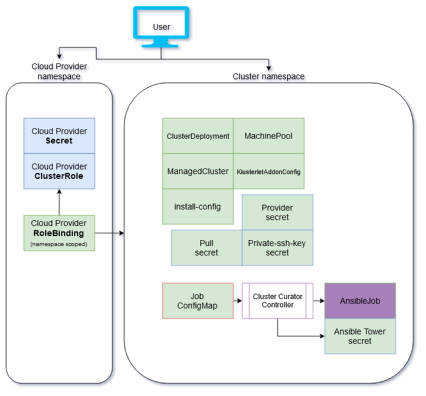

# Cluster-Curator-Controller

[](http://www.apache.org/licenses/LICENSE-2.0.html)

## What is cluster-curator-controller
This project contains jobs and controllers for curating work around Cluster Provisioning. It is designed to extend the capabilities already present within Hive `ClusterDeployment` and Open Cluster Management `ManagedCluster` kinds. Hosted cluster support was added as well so now the controller also handles `HostedCluster` and `NodePool` kinds. The controller will automatically detect between Hive and Hosted clusters and will handle each type accordingly.

## Architecture
The controller found here, monitors for `ClusterCurator` kind.  When new instances of the resource are created, this controller creates a Kubernetes Job (curator job) that runs: `pre-hook Ansible`, `activate-and-monitor` and `posthook Ansible`.  The Job can be overridden with your own job flow.

\
For more details on job flow within our architecture see our [**swimlane chart**](https://swimlanes.io/u/kGNg12_Vw).

## Getting started

- ### Built in curation jobs:

  | Job action | Description | Cloud Provider | Cluster Curator |
  | :---------:| :---------: | :------------: | :----------------: |
  |applycloudprovider-(aws/gcp/azure/vmware)| Creates AWS/GCP/Azure/VMware related credentials for a cluster deployment | X | X |
  |applycloudprovider-ansible | Creates the Ansible tower secret for a cluster deployment (included in applycloudprovider-aws) | X | X |
  | activate-and-monitor | Sets `ClusterDeployment.spec.installAttempsLimit: 1`, then monitors the deployment of the cluster | | X | 
  | monitor-import | Monitors the ManagedCluster import | | X |
  | prehook-ansiblejob posthook-ansiblejob | Creates an AnsibleJob resource and monitors it to completion |  | X |
  | monitor | Watches a `ClusterDeployment` Provisioning Job | | |


  - Here is an example of each job described above. You can add and remove instances of the job containers as needed. You can also inject your own containers `./deploy/jobs/create-cluster.yaml`

---

- ### Steps for development:

  - Compile binaries
    ```bash
    make compile-curator
    ```
    This will compile the two binaries `manager` and `curator` in `./build/_output`

  - Push image to a repo
    
    * Connect your local docker daemon to your prefered registry
      ```bash
      export VERSION=1.0    # This is used as the docker image tag

      export REPO_URL=quay.io/MY_REPOSITORY  # This can also be a docker registry

      make push-curator
      ```
    * You can now modify the `image:` references (there are x2) in `deploy/controller/deployment.yaml`

  - Updating the `Type.go` and `CRD`
  
    * Requires controller-gen be installed, the makefile will attempt to install it if it is not present.
      ``` bash
      make generate   # Creates the groups and deep copy scafold

      make manifests  # Regenerates the CRDs
      ```

---

- ### Steps for deployment:
  - Connect to the OpenShift hub, the cluster  with Open Cluster Management installed
    ```bash
    oc apply -k deploy/controller
    ```
  - This deployment defaults to the namespace `open-cluster-management`. Each time a new `ClusterCurator` resource is created, you will see operations take place in the controller pod's log, as well as the `status.conditions` on the ClusterCurator resource.

---

- ### Hive cluster provisioning example: _(AWS)_

  * In the Red Hat Advanced Cluster Management console, create a NEW cluster. Before you press the button to create the button, flip the YAML switch.  Add the annotation `hive.openshift.io/reconcile-pause=true`, then press **Create**

  * The cluster will show in the console as **Creating**, but it is waiting for curation. If you will be using Ansible, create a secret in the cluster namespace. Here is a an example:
    ```yaml
    ---
    apiVersion: v1
    kind: Secret
    metadata:
      name: toweraccess
      namespace: MY_CLUSTER_NAMESPACE
    stringData:
      host: https://my-tower-domain.io
      token: ANSIBLE_TOKEN_FOR_admin  
    ```

  * Now create the ClusterCurator resource kind in the cluster namespace. This will begin curation of your cluster provisioning.
    ```yaml
    ---
    apiVersion: cluster.open-cluster-management.io/v1beta1
    kind: ClusterCurator
    metadata:
      name: MY_CLUSTER_NAME
      namespace: MY_CLUSTER_NAMESPACE
      labels:
        open-cluster-management: curator
    spec:
      desiredCuration: install
      install:
        prehook:
          - name: Demo Job Template
            extra_vars:
              variable1: something-interesting
              variable2: 2
          - name: Demo Job Template
        posthook:
          - name: Demo Job Template
    ```
  * For each ansibleJob that will be created, two special keys will be created in `extra_vars`:
    1. `cluster_deployment`, which has general information about the cluster
    2. `machine_pool` which has details about the worker nodes being created in the cluster
    
    These are made available to be used by the AnsibleJob during execution

  * The provisiong will start. To find the curator job, run the following command:
    ```bash
    oc -n MY_CLUSTER get ClusterCurator -o yaml
    ```
    This will return the YAML for the ClusteCurator resource, in the `spec` is a field `curatorJob`, this has the Job that is curating the cluster. Also note the `status.conditions`, each step performed by the curator job will have a condition where the `status: "False"`. The `type` of each condition is a step(InitContainer) in the curator job. You can combine the job name and the type value to retreive the logs
    ```yaml
    spec:
      curatorJob: curator-job-d9pwh
      ...
    status:
      conditions:
      - lastTransitionTime: "2021-03-30T03:58:59Z"
        message: Executing init container prehook-ansiblejob
        reason: Job_has_finished
        status: "False"
        type: prehook-ansiblejob
  
    ```

### Hosted cluster provisioning example: _(KubeVirt)_

  * When creating the `HostedCluster` and `NodePool` resource add the `spec.pausedUntil` field with value `true` to both resources. If using the `hcp create cluster` CLI you can specify the flag `--pausedUntil true`.

    ```yaml
    apiVersion: hypershift.openshift.io/v1beta1
    kind: HostedCluster
    metadata:
      name: my-cluster
      namespace: clusters
    spec:
      pausedUntil: 'true'
    ...
    ```

    ```yaml
    apiVersion: hypershift.openshift.io/v1beta1
    kind: NodePool
    metadata:
      name: my-cluster-us-east-2
      namespace: clusters
    spec:
      pausedUntil: 'true'
    ...
    ```

  * The cluster will show in the console as Creating, but it is waiting for curation. If you will be using Ansible, create a secret in the same namespace as the `HostedCluster` resource. Here is a an example:

    ```yaml
    ---
    apiVersion: v1
    kind: Secret
    metadata:
      name: toweraccess
      namespace: HOSTED_CLUSTER_NAMESPACE
    stringData:
      host: https://my-tower-domain.io
      token: ANSIBLE_TOKEN_FOR_admin  
    ```

  * Now create the ClusterCurator resource kind in the `HostedCluster` namespace. The ClusterCurator name is required to be the same as the `HostedCluster` name. This will begin curation of your cluster provisioning by removing the `spec.pausedUntil` field in all the `HostedCluster` and `NodePool` resources.
    ```yaml
    ---
    apiVersion: cluster.open-cluster-management.io/v1beta1
    kind: ClusterCurator
    metadata:
      name: HOSTED_CLUSTER_NAME
      namespace: HOSTED_CLUSTER_NAMESPACE
      labels:
        open-cluster-management: curator
    spec:
      desiredCuration: install
      install:
        prehook:
          - name: Demo Job Template
            extra_vars:
              variable1: something-interesting
              variable2: 2
          - name: Demo Job Template
        posthook:
          - name: Demo Job Template
        towerAuthSecret: toweraccess
    ```
  Note: The `desiredCuration` commands are exactly the same as the Hive cluster since the controller will auto-detect the cluster type

  * To monitor the status of the provision you can look at either the `ClusterCurator` status or look at the job logs from the `HostedCluster` namespace.
---

- ### Diagnostic steps:
  
  - Run the following command to see the logs
    ```bash
    # oc logs job/CURATOR_JOB_NAME TYPE_VALUE
    oc logs job/curator-job-d9pwh -c prehook-ansiblejob

    oc logs job/curator-job-d9pwh -c activate-and-monitor

    oc logs job/curator-job-d9pwh -c posthook-ansiblejob
    ```
  - Add a "-f" to the end if you want to tail the output

    If there is a failure, the job will show Failure.  Look at the `curator-job-container` value to see which step in the provisioning failed and review the logs above. If the `curator-job-contianer` is `monitor`, there may be an additional `provisioning` job. Check this log for additional information.

    The generated YAML can be committed to a Git repository. You can then use an ACM Subscription to apply the YAML (provision) on the ACM Hub.  Repeat steps 1 & 3 to create new clusters.

---

- ### Steps for test:

  ```bash
  make unit-tests
  ```

- Check the [Security guide](SECURITY.md) if you need to report a security issue.
